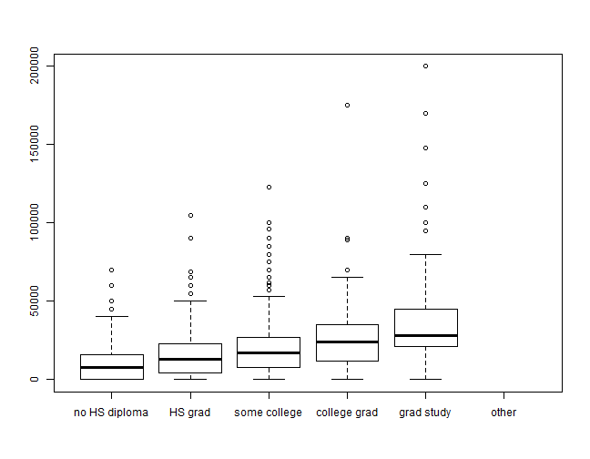

% R bootcamp, Module 3: Calculations
% August 2013, UC Berkeley
% Chris Paciorek


# Vectorized calculations

Note to BB: remember to start recording.

As we've seen, R has many functions that allow you to operate on each element of a vector all at once.


```r
vals <- rnorm(1000)
chi2vals <- vals^2
chi2_df1000 <- sum(chi2vals)
# imagine if the code above were a loop, or three separate loops
```


Advantages:

* much faster than looping
* easier to code
* easier to read and understand the code

Sometimes there are surprises in terms of what is fast, as well as tricks for vectorizing things in unexpected ways:

```r
vals <- rnorm(1e+06)
system.time(trunc <- ifelse(vals > 0, vals, 0))
```

```
##    user  system elapsed 
##    0.16    0.00    0.15
```

```r
system.time(vals <- vals * (vals > 0))
```

```
##    user  system elapsed 
##    0.02    0.00    0.02
```


```r
tmp <- as.character(vote$age60)
vote$ageMin <- substring(tmp, 1, 2)
vote$ageMin[1:5]
```

```
## [1] "18" "18" "30" "30" "30"
```


What am I doing with `vals * (vals > 0)` ? What happens behind the scenes in R?

If you use a trick like this, having a comment in your code is a good idea.

# Linear algebra 

R can do essentially any linear algebra you need. It uses system-level packages called BLAS (basic linear algebra subroutines) and LAPACK (linear algebra package). Note that these calculations will be essentially as fast as if you wrote C code because R just calls C and Fortran routines to do the calculations.

The BLAS that comes with R is fairly slow. It's possible to use a faster BLAS, as well as one that uses multiple cores automatically. This can in some cases give you an order of magnitude speedup if your work involves a lot of matrix manipulations/linear algebra. More details in Module 11.


# Vectorized vector/matrix calculations

Recall that `+`, `-`,`*`, `/` do vectorized calculations:


```r
A <- matrix(1:9, 3)
B <- matrix(seq(4, 36, by = 4), 3)

A + B
```

```
##      [,1] [,2] [,3]
## [1,]    5   20   35
## [2,]   10   25   40
## [3,]   15   30   45
```

```r
A + B[, 1]
```

```
##      [,1] [,2] [,3]
## [1,]    5    8   11
## [2,]   10   13   16
## [3,]   15   18   21
```

```r
A * B
```

```
##      [,1] [,2] [,3]
## [1,]    4   64  196
## [2,]   16  100  256
## [3,]   36  144  324
```

```r
A * B[, 1]
```

```
##      [,1] [,2] [,3]
## [1,]    4   16   28
## [2,]   16   40   64
## [3,]   36   72  108
```


Matrix/vector multiplication


```r
A %*% B[, 1]
```

```
##      [,1]
## [1,]  120
## [2,]  144
## [3,]  168
```

```r
A %*% B
```

```
##      [,1] [,2] [,3]
## [1,]  120  264  408
## [2,]  144  324  504
## [3,]  168  384  600
```

```r

identical(t(A) %*% A, crossprod(A))
```

```
## [1] TRUE
```


Some decompositions


```r
require(fields)
times <- seq(0, 1, length = 100)
R <- exp(-rdist(times)/0.2)  # a correlation matrix
e <- eigen(R)
range(e$values)
```

```
## [1]  0.02525 32.85537
```

```r
e$vectors[, 1]
```

```
##   [1] 0.05195 0.05449 0.05699 0.05946 0.06190 0.06431 0.06669 0.06903
##   [9] 0.07133 0.07360 0.07583 0.07802 0.08017 0.08227 0.08433 0.08635
##  [17] 0.08833 0.09025 0.09213 0.09396 0.09575 0.09748 0.09916 0.10079
##  [25] 0.10236 0.10388 0.10535 0.10676 0.10812 0.10942 0.11066 0.11185
##  [33] 0.11297 0.11404 0.11505 0.11599 0.11688 0.11770 0.11846 0.11916
##  [41] 0.11980 0.12038 0.12089 0.12134 0.12172 0.12204 0.12230 0.12249
##  [49] 0.12262 0.12269 0.12269 0.12262 0.12249 0.12230 0.12204 0.12172
##  [57] 0.12134 0.12089 0.12038 0.11980 0.11916 0.11846 0.11770 0.11688
##  [65] 0.11599 0.11505 0.11404 0.11297 0.11185 0.11066 0.10942 0.10812
##  [73] 0.10676 0.10535 0.10388 0.10236 0.10079 0.09916 0.09748 0.09575
##  [81] 0.09396 0.09213 0.09025 0.08833 0.08635 0.08433 0.08227 0.08017
##  [89] 0.07802 0.07583 0.07360 0.07133 0.06903 0.06669 0.06431 0.06190
##  [97] 0.05946 0.05699 0.05449 0.05195
```

```r

sv <- svd(R)
U <- chol(R)

devs <- rnorm(100)
Rinvb <- solve(R, devs)  # R^{-1} b
Rinv <- solve(R)  # R^{-1} -- try to avoid this
```


# Pre-allocation

This is slow.

```r
vals <- 0
n <- 50000
system.time({
    for (i in 1:n) vals <- c(vals, i)
})
```

```
##    user  system elapsed 
##    1.73    0.00    1.72
```


The same holds for using `rbind()`, `cbind()`, or adding to a list, one element at a time.

This is slow and unclear:

```r
vals <- 0
n <- 50000
system.time({
    for (i in 1:n) vals[i] <- i
})
```

```
##    user  system elapsed 
##    1.84    0.00    1.87
```


Thoughts on why these are so slow? Think about what R might be doing behind the scenes

# The answer is to pre-allocate memory

This is not so slow. (Please ignore the for-loop hypocrisy and the fact that I could do this as `vals <- 1:n`.)


```r
n <- 50000
system.time({
    vals <- rep(NA, n)
    # alternatively: vals <- as.numeric(NA); length(vals) <- n
    for (i in 1:n) vals[i] <- i
})
```

```
##    user  system elapsed 
##    0.08    0.00    0.08
```


Here's how to pre-allocate an empty list: 

```r
vals <- list()
length(vals) <- n
head(vals)
```

```
## [[1]]
## NULL
## 
## [[2]]
## NULL
## 
## [[3]]
## NULL
## 
## [[4]]
## NULL
## 
## [[5]]
## NULL
## 
## [[6]]
## NULL
```


# apply

Some functions aren't vectorized, or you may want to use a function on every row or column of a matrix/data frame, every element of a list, etc.

For this we use the `apply()` family of functions.


```r
mat <- matrix(rnorm(100 * 1000), nr = 100)
row_min <- apply(mat, MARGIN = 1, FUN = min)
col_max <- apply(mat, MARGIN = 2, FUN = max)
```


There are actually some even faster specialized functions:

```r
row_mean <- rowMeans(mat)
col_sum <- colSums(mat)
```


# `lapply()` and `sapply()`


```r
myList <- list(rnorm(3), rnorm(3), rnorm(5))
lapply(myList, min)
```

```
## [[1]]
## [1] -1.753
## 
## [[2]]
## [1] -1.799
## 
## [[3]]
## [1] -2.312
```

```r
sapply(myList, min)
```

```
## [1] -1.753 -1.799 -2.312
```


Note that we don't generally want to use `apply()` on a data frame. 

You can use `lapply()` and `sapply()` on regular vectors, such as vectors of indices, which can come in handy, though this is a silly example:

```r
sapply(1:10, function(x) x^2)
```

```
##  [1]   1   4   9  16  25  36  49  64  81 100
```


Here's a cool trick to pull off a particular element of a list of lists:


```r
params <- list(a = list(mn = 7, sd = 3), b = list(mn = 6, sd = 1), c = list(mn = 2, 
    sd = 1))
sapply(params, "[[", 1)
```

```
## a b c 
## 7 6 2
```


Think about why this works. 

Hint:

```r
test <- list(5, 7, 3)
test[[2]]
```

```
## [1] 7
```

```r
# `[[`(test, 2) # need it commented or R Markdown processing messes it
# up...

# `+`(3, 7)
```


# And more `apply()`s

There are a bunch of `apply()` variants, as well as parallelized versions of them:

* `tapply()`, `vapply()`, `mapply()`, `rapply()`, `eapply()`
* for parallelized versions see Module 11 or `?clusterApply`)

# Tabulation 

- Sometimes we need to do some basic checking for the number of observations or types of observations in our dataset
- To do this quickly and easily, `table()` is our friend
- Let's look at our observations by year and grade


```r
unique(vote$pres04)
```

```
## [1]  1  2  3  9 NA  0  4
```

```r
tbl <- table(vote$race, vote$pres04)
tbl
```

```
##                  
##                       0     1     2     3     4     9
##   white             111 26184 33045   417    14   409
##   black              18  6183   824    56     0    21
##   hispanic/latino     6  2665  1639    34     3    49
##   asian               0   626   384     7     1     2
##   other              16  1036   653    22     0    32
```

```r
round(prop.table(tbl, margin = 1), 3)
```

```
##                  
##                       0     1     2     3     4     9
##   white           0.002 0.435 0.549 0.007 0.000 0.007
##   black           0.003 0.871 0.116 0.008 0.000 0.003
##   hispanic/latino 0.001 0.606 0.373 0.008 0.001 0.011
##   asian           0.000 0.614 0.376 0.007 0.001 0.002
##   other           0.009 0.589 0.371 0.013 0.000 0.018
```

```r
table(vote$race, vote$pres04, vote$sex)
```

```
## , ,  = male
## 
##                  
##                       0     1     2     3     4     9
##   white              55 11200 15582   230     9   262
##   black               6  2440   419    37     0    13
##   hispanic/latino     3  1140   784    18     3    28
##   asian               0   300   181     2     1     1
##   other               7   464   335     9     0    25
## 
## , ,  = female
## 
##                  
##                       0     1     2     3     4     9
##   white              55 14922 17387   186     5   147
##   black              11  3688   401    19     0     8
##   hispanic/latino     3  1505   845    15     0    21
##   asian               0   325   201     4     0     1
##   other               9   566   310    12     0     7
```

```r
with(vote[vote$sex == "female", ], table(pres04, race))
```

```
##       race
## pres04 white black hispanic/latino asian other
##      0    55    11               3     0     9
##      1 14922  3688            1505   325   566
##      2 17387   401             845   201   310
##      3   186    19              15     4    12
##      4     5     0               0     0     0
##      9   147     8              21     1     7
```


Can you figure out what `with()` does just by example? 

# Stratified analyses I
Often we want to do individual analyses within subsets or clusters of our data.

As a first step, we might want to just split our dataset by a stratifying variable.


```r
subsets <- split(earnings, earnings$race)
length(subsets)
```

```
## [1] 5
```

```r
subsets[["9"]]
```

```
##       earn height1 height2 sex race hisp ed yearbn height
## 239     NA      NA      NA   2    9    9 16     99     NA
## 794     NA       5       5   2    9    2 16     34     65
## 966      0       5       1   2    9    1 16     67     61
## 1027    NA       5       5   2    9    2 12     31     65
## 1054     0       5       3   2    9    2  8     38     63
## 1507  4416       5       2   2    9    2  6     18     62
## 1676 18000       5       6   1    9    1 17     64     66
## 1713 53000       5       3   2    9    1 17     58     63
```


The `%in%` operator can also be helpful.


```r
sub <- earnings[earnings$race %in% c(1, 2, 4), ]
```


# Stratified analyses II

Often we want to do individual analyses within subsets or clusters of our data. R has a variety of tools for this; for now we'll look at `aggregate()` and `by()`. These are wrappers of `tapply()`. 


```r
aggregate(earnings, by = list(educ = earnings$ed), FUN = median, na.rm = TRUE)
```

```
##    educ  earn height1 height2 sex race hisp ed yearbn height
## 1     2    NA       5     0.0   1    2    2  2    0.0   60.0
## 2     3  1400       5     2.0   2    1    1  3   26.0   62.0
## 3     4  6600       5     7.5   2    1    2  4   21.0   66.0
## 4     5  1200       5     3.0   2    1    2  5   17.0   63.0
## 5     6  4416       5     5.0   1    1    2  6   20.0   67.0
## 6     7  7000       5     5.0   2    1    2  7   22.0   66.0
## 7     8  6250       5     5.0   2    1    2  8   32.0   66.0
## 8     9  7000       5     4.0   2    1    2  9   38.0   65.0
## 9    10  8000       5     4.0   2    1    2 10   35.0   66.0
## 10   11 10000       5     6.0   2    1    2 11   42.5   67.0
## 11   12 13000       5     5.0   2    1    2 12   52.0   66.0
## 12   13 15000       5     4.0   2    1    2 13   53.0   66.0
## 13   14 20000       5     5.0   2    1    2 14   53.0   66.5
## 14   15 17000       5     4.0   2    1    2 15   51.5   66.0
## 15   16 24000       5     5.0   2    1    2 16   55.0   66.0
## 16   17 25000       5     6.0   2    1    2 17   50.0   67.0
## 17   18 30000       5     6.0   1    1    2 18   47.0   68.0
## 18   98    NA       5     6.0   2    2    2 98   18.0   66.0
## 19   99    NA       6     0.0   1    1    2 99   37.0   72.0
```

```r
aggregate(earn ~ ed, data = earnings, FUN = median)
```

```
##    ed  earn
## 1   3  1400
## 2   4  6600
## 3   5  1200
## 4   6  4416
## 5   7  7000
## 6   8  6250
## 7   9  7000
## 8  10  8000
## 9  11 10000
## 10 12 13000
## 11 13 15000
## 12 14 20000
## 13 15 17000
## 14 16 24000
## 15 17 25000
## 16 18 30000
```

```r
aggregate(earn ~ ed + hisp, data = earnings, FUN = median)
```

```
##    ed hisp  earn
## 1   3    1  1400
## 2   6    1  7000
## 3   8    1  5200
## 4   9    1     0
## 5  10    1     0
## 6  11    1 15000
## 7  12    1 12000
## 8  13    1 17500
## 9  14    1 17000
## 10 15    1  2500
## 11 16    1 17000
## 12 17    1 27000
## 13 18    1 42500
## 14  4    2  6600
## 15  5    2  1200
## 16  6    2  4416
## 17  7    2  7000
## 18  8    2  6250
## 19  9    2  8500
## 20 10    2  9000
## 21 11    2 10000
## 22 12    2 14000
## 23 13    2 15000
## 24 14    2 20000
## 25 15    2 17500
## 26 16    2 24500
## 27 17    2 25000
## 28 18    2 30000
```

```r
agg <- aggregate(earn ~ ed + hisp, data = earnings, FUN = median)
xtabs(earn ~ ., data = agg)
```

```
##     hisp
## ed       1     2
##   3   1400     0
##   4      0  6600
##   5      0  1200
##   6   7000  4416
##   7      0  7000
##   8   5200  6250
##   9      0  8500
##   10     0  9000
##   11 15000 10000
##   12 12000 14000
##   13 17500 15000
##   14 17000 20000
##   15  2500 17500
##   16 17000 24500
##   17 27000 25000
##   18 42500 30000
```


Notice the 'long' vs. 'wide' formats. You'll see more about that sort of thing in Module 6.

# Discretization

You may need to discretize a categorical variable, e.g., by education level:

```r
earnings$edLevel <- cut(earnings$ed, breaks = c(0, 11, 12, 15, 16, 18, 99))
levels(earnings$edLevel) <- c("no HS diploma", "HS grad", "some college", "college grad", 
    "grad study", "other")
boxplot(earn ~ edLevel, data = earnings)
```

 


# Stratified analyses III

`aggregate()` works fine when the output is univariate, but what about more complicated analyses than computing the median, such as fitting a set of regressions?


```r
out <- by(earnings, earnings$edLevel, function(x) {
    if (sum(!is.na(x$earn))) 
        lm(earn ~ height, data = x) else NA
})
length(out)
```

```
## [1] 6
```

```r
summary(out[[5]])
```

```
## 
## Call:
## lm(formula = earn ~ height, data = x)
## 
## Residuals:
##    Min     1Q Median     3Q    Max 
## -48563 -16907  -5810   6902 157470 
## 
## Coefficients:
##             Estimate Std. Error t value Pr(>|t|)    
## (Intercept)  -121555      43803   -2.78  0.00623 ** 
## height          2344        648    3.62  0.00041 ***
## ---
## Signif. codes:  0 '***' 0.001 '**' 0.01 '*' 0.05 '.' 0.1 ' ' 1 
## 
## Residual standard error: 29700 on 148 degrees of freedom
##   (75 observations deleted due to missingness)
## Multiple R-squared: 0.0812,	Adjusted R-squared: 0.075 
## F-statistic: 13.1 on 1 and 148 DF,  p-value: 0.000409
```


What's the business with the `if` statement? Why is this good practice?

# Sorting

`sort()` applied to a vector does what you expect.

Sorting a matrix or dataframe based on one or more columns is a somewhat manual process, but once you get the hang of it, it's not bad.


```r
ord <- order(earnings$earn, earnings$height, decreasing = TRUE)
# ord <- with(earnings, order(earn, height, decreasing = TRUE))
ord[1:5]
```

```
## [1] 1860  583  351  618  314
```

```r
(earnings$earn[ord])[c(1:5, 2025:2029)]  # parentheses for clarity
```

```
##  [1] 200000 175000 170000 148000 125000     NA     NA     NA     NA     NA
```

```r
earnings_ordered <- earnings[ord, ]
```


You could of course write your own *sort* function that uses `order()`. More in Module 5.

# Merging Data

We often need to combine data across multiple data frames, merging on common fields (i.e., *keys*). In database terminology, this is a *join* operation.

Here's an example using the voting data combined with a built-in R dataset on state information. Warning: the state dataset is *very* old; this is just a toy example. 

In this case (as often true) we need to do some machinations to get everything prepared for the merge. The *key* we use is the state name.


```r
# PRE-PROCESSING a bit of querying indicates the state numbers are in
# alphabetical order, so we can do this:
numToName <- data.frame(stateNum = 1:50, stateName = row.names(state.x77))
voteWithStateNames <- merge(vote, numToName, by.x = "state", by.y = "stateNum", 
    all.x = TRUE, all.y = FALSE)
stateInfo <- data.frame(state.x77)
# need the names as column, not as the row names attribute:
stateInfo$name <- row.names(stateInfo)

# ACTUAL DEMONSTRATION
fullVote <- merge(voteWithStateNames, stateInfo[, c("name", "Population", "Income", 
    "Illiteracy", "Life.Exp")], by.x = "stateName", by.y = "name", all.x = TRUE, 
    all.y = FALSE)
dim(vote)
```

```
## [1] 76205    18
```

```r
dim(fullVote)
```

```
## [1] 76205    23
```

```r
fullVote[1:2, ]
```

```
##   stateName state pres04    sex  race  age9    partyid          income
## 1   Alabama     1      2 female white 50-59 republican $30,000-$49,999
## 2   Alabama     1      2   male white 30-39 republican $15,000-$29,999
##      relign8 age60 age65 geocode               sizeplac brnagain attend
## 1 protestant 45-59 50-64       4 city: 10,000 to 49,999      yes   <NA>
## 2 mormon/lds 30-44 30-39       2                  rural      yes   <NA>
##   year region y ageMin Population Income Illiteracy Life.Exp
## 1 2004      1 1     45       3615   3624        2.1    69.05
## 2 2004      1 1     30       3615   3624        2.1    69.05
```


What's the deal with the `all.x` and `all.y` ?  We can tell R whether we want to keep all of the `x` observations, all the `y` observations, or neither, or both, when there may be rows in either of the datasets that don't match the other dataset.

# Breakout

## Problem 1

Suppose we have two categorical variables and we conduct a hypothesis test of independence. The chi-square statistic is: 

$$
\chi^2 = \sum_{i=1}^{n}\sum_{j=1}^{m} \frac{(y_{ij} - e_{ij})^2}{e_{ij}}, 
$$ 

where $e_{ij} = \frac{y_{i\cdot} y_{\cdot j}}{y_{\cdot \cdot}}$, with $y_{i\cdot}$ the sum of the values in the i'th row, $y_{\cdot j}$ the sum of values in the j'th column, and $y_{\cdot\cdot}$ the sum of all the values. Suppose I give you a matrix in R with the $y_{ij}$ values. 

You can generate a test matrix as: `y <- matrix(sample(1:10, 12, replace = TRUE), nrow = 3, ncol = 4)`.

Compute the statistic without *any* loops as follows:

1. Assume you have the *e* matrix. How do you compute the statistic without loops?
2. How can you construct the *e* matrix? Hint: the numerator of *e* is just an *outer product* for which the `outer()` function can be used.


## Problem 2

For each combination of sex and education level, find the *second* largest value of earnings amongst the people in the group without any looping.
